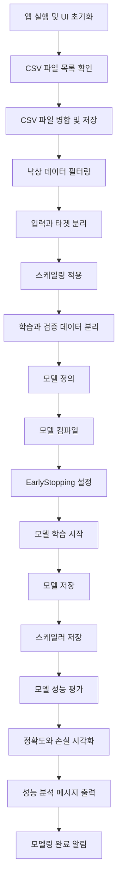
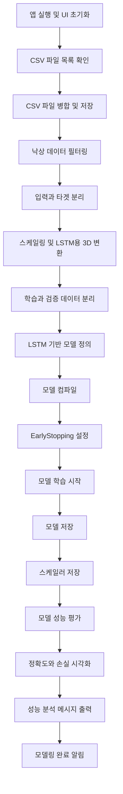
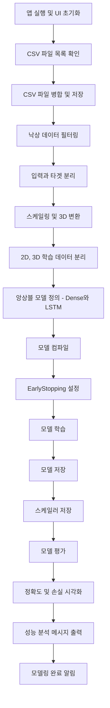

```mermaid
graph TD
    A[앱 실행 및 UI 초기화] --> B[CSV 파일 목록 확인]
    B --> C[CSV 파일 병합 및 저장]
    C --> D[낙상 데이터 필터링]
    D --> E[입력과 타겟 분리]
    E --> F[스케일링 적용]
    F --> G[학습과 검증 데이터 분리]
    G --> H[모델 정의]
    H --> I[모델 컴파일]
    I --> J[EarlyStopping 설정]
    J --> K[모델 학습 시작]
    K --> L[모델 저장]
    L --> M[스케일러 저장]
    M --> N[모델 성능 평가]
    N --> O[정확도와 손실 시각화]
    O --> P[성능 분석 메시지 출력]
    P --> Q[모델링 완료 알림]
```

```mermaid
graph TD
    A[앱 실행 및 UI 초기화] --> B[CSV 파일 목록 확인]
    B --> C[CSV 파일 병합 및 저장]
    C --> D[낙상 데이터 필터링]
    D --> E[입력과 타겟 분리]
    E --> F[스케일링 및 LSTM용 3D 변환]
    F --> G[학습과 검증 데이터 분리]
    G --> H[LSTM 기반 모델 정의]
    H --> I[모델 컴파일]
    I --> J[EarlyStopping 설정]
    J --> K[모델 학습 시작]
    K --> L[모델 저장]
    L --> M[스케일러 저장]
    M --> N[모델 성능 평가]
    N --> O[정확도와 손실 시각화]
    O --> P[성능 분석 메시지 출력]
    P --> Q[모델링 완료 알림]
```

```mermaid
graph TD
    A[앱 실행 및 UI 초기화] --> B[CSV 파일 목록 확인]
    B --> C[CSV 파일 병합 및 저장]
    C --> D[낙상 데이터 필터링]
    D --> E[입력과 타겟 분리]
    E --> F[스케일링 및 3D 변환]
    F --> G[2D, 3D 학습 데이터 분리]
    G --> H[앙상블 모델 정의 - Dense와 LSTM]
    H --> I[모델 컴파일]
    I --> J[EarlyStopping 설정]
    J --> K[모델 학습]
    K --> L[모델 저장]
    L --> M[스케일러 저장]
    M --> N[모델 평가]
    N --> O[정확도 및 손실 시각화]
    O --> P[성능 분석 메시지 출력]
    P --> Q[모델링 완료 알림]
```

```mermaid
graph TD
    A[앱 실행 및 UI 초기화] --> B[CSV 파일 목록 확인]
    B --> C[CSV 파일 병합 및 저장]
    C --> D[낙상 데이터 필터링]
    D --> E[입력과 타겟 분리]
    E --> F[스케일링 및 3D 변환]
    F --> G[2D, 3D 학습 데이터 분리]
    G --> H[앙상블 모델 정의 - Dense와 LSTM]
    H --> I[모델 컴파일]
    I --> J[EarlyStopping 설정]
    J --> K[모델 학습]
    K --> L[모델 저장]
    L --> M[스케일러 저장]
    M --> N[모델 평가]
    N --> O[정확도 및 손실 시각화]
    O --> P[성능 분석 메시지 출력]
    P --> Q[모델링 완료 알림]
```
